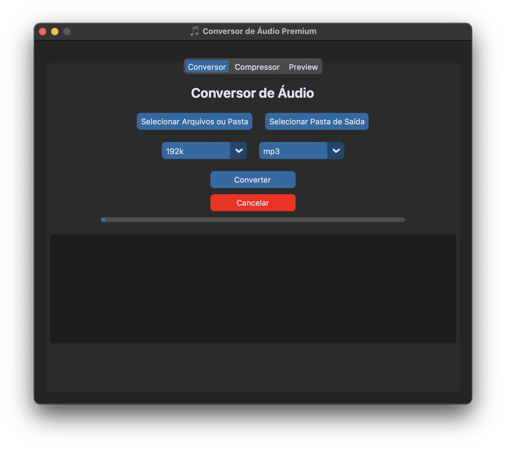
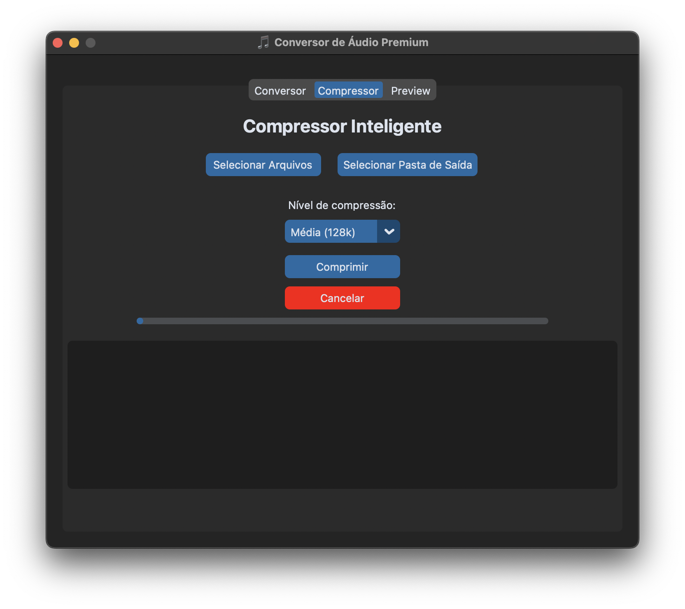

# 🎵 Conversor de Áudio

<p align="center">
  
</p>

# 🚨ÍCONE GERADO POR IA

## 📑 Sumário

- [Executáveis Disponíveis](#-executáveis-disponíveis)
- [Demonstração Visual](#-demonstração-visual)
- [Requisitos](#-requisitos)
- [Como usar o aplicativo (modo desenvolvedor)](#-como-usar-o-aplicativo-modo-desenvolvedor)
- [Funcionalidades](#-funcionalidades)
- [Estrutura do Projeto](#-estrutura-do-projeto)
- [Licença](#-licença)
- [Contribuindo](#-contribuindo)

Interface gráfica moderna e intuitiva para conversão e compressão de arquivos de áudio, com design inspirado no estilo macOS. Desenvolvido em Python utilizando CustomTkinter, este aplicativo oferece uma experiência premium tanto para usuários de macOS quanto de Windows.

---

## 📦 Executáveis Disponíveis

- ✅ Aplicativo para **macOS (`.app`)**
- ✅ Aplicativo para **Windows (`.exe`)**

🔗 Acesse os executáveis prontos na aba **Releases** deste repositório:
[👉 Clique aqui para acessar as releases](https://github.com/AraujoJads/AudioTransformer/releases/tag/v1.0.0)

---

## ✨ Demonstração Visual

<p align="center">
  
</p>

<p align="center">
  
</p>

---

## 🧰 Requisitos

### ✅ Compatibilidade
- **Python**: versões 3.10 até **3.12** (🚫 Python 3.13 não é suportado)
- **Sistemas Suportados**:
  - macOS (executando `.app` ou via terminal)
  - Windows (executando `.exe` ou via Python)

### ⚙️ Dependências
- [FFmpeg](https://ffmpeg.org/download.html): necessário para conversão e compressão de áudio
  - O aplicativo detecta automaticamente:
    - FFmpeg embutido (`ffmpeg/ffmpeg` ou `ffmpeg/ffmpeg.exe`)
    - FFmpeg instalado no sistema (via `PATH`)
    - Ou exibe mensagem amigável com link para instalação

---

## 🚀 Como usar o aplicativo (modo desenvolvedor)

### 1. Clone o repositório
```bash
git clone https://github.com/AraujoJads/ConversorDeAudio.git
cd ConversorDeAudio
```

### 2. Crie um ambiente virtual
```bash
python3.12 -m venv .venv
source .venv/bin/activate  # macOS/Linux
.venv\Scripts\activate     # Windows
```

### 3. Instale as dependências
```bash
pip install -r requirements.txt
```

### 4. Execute o aplicativo
```bash
python main.py
```

---

## 🖥 Funcionalidades

### 🎧 Conversor de Áudio (Aba 1)
- Suporte a múltiplos formatos: `.mp3`, `.wav`, `.flac`, `.aac`, `.ogg`
- Escolha da qualidade de saída (bitrate)
- Seleção da pasta de destino e extensão final

### 📦 Compressor de Qualidade (Aba 2)
- Compacta arquivos mantendo a fidelidade sonora
- Ideal para reduzir o tamanho de arquivos pesados

### 🎛️ Preview (Aba 3)
- Compare o áudio original com o convertido
- Player embutido simples para verificação rápida

---

## 📁 Estrutura do Projeto

```
ConversorDeAudio/
├── main.py
├── version.py
├── ffmpeg_installer.py
├── assets/
│   └── icon.png
├── ffmpeg/         # (opcional: ffmpeg embutido)
├── tabs/
│   ├── tab_converter.py
│   ├── tab_compressor.py
│   └── tab_preview.py
├── requirements.txt
└── README.md
```

---

## 📜 Licença

Este projeto está licenciado sob a Licença MIT.

---

## 🤝 Contribuindo

Contribuições são bem-vindas!

1. Faça um fork do projeto
2. Crie uma branch para sua feature: `git checkout -b minha-feature`
3. Faça commit das suas mudanças: `git commit -m 'feat: nova funcionalidade'`
4. Faça push para o repositório remoto: `git push origin minha-feature`
5. Abra um Pull Request ✨

---

<p align="center">
  Desenvolvido por Antonio Alves — 2025
</p>
